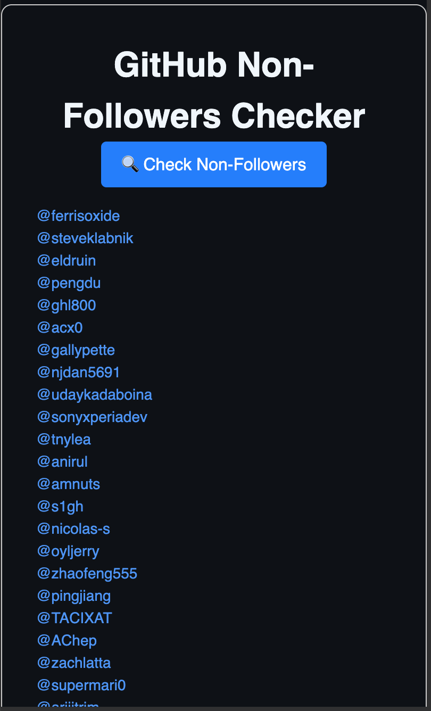

# 📟 GitHub Non-Followers Checker

A simple, client-side tool that helps you identify which GitHub users you follow that don't follow you back. (I know, sometimes you would want to unfollow those who don't follow you back 😏)

---

### 🚀 How to Use

1. Open your browser's **Developer Console**:

   * Windows: `Ctrl + Shift + J`
   * Mac: `Cmd + Option + I`

2. Paste the full JavaScript code below and hit **Enter**. (Or you can click [here](checker.js) for the code):
``` javascript
"use strict";

const GITHUB_API_URL = "https://api.github.com/users/";

let nonFollowersList = [];
let isActiveProcess = false;

function sleep(ms) {
    return new Promise((resolve) => setTimeout(resolve, ms));
}

async function getAllFollowers(username) {
    let followers = [];
    let page = 1;
    while (true) {
        const response = await fetch(`${GITHUB_API_URL}${username}/followers?per_page=100&page=${page}`);
        if (!response.ok) throw new Error('Error fetching followers: ' + response.statusText);
        const data = await response.json();
        if (data.length === 0) break;
        followers = followers.concat(data);
        page++;
    }
    return followers;
}

async function getAllFollowing(username) {
    let following = [];
    let page = 1;
    while (true) {
        const response = await fetch(`${GITHUB_API_URL}${username}/following?per_page=100&page=${page}`);
        if (!response.ok) throw new Error('Error fetching following: ' + response.statusText);
        const data = await response.json();
        if (data.length === 0) break;
        following = following.concat(data);
        page++;
    }
    return following;
}

async function findNonFollowers(username) {
    if (isActiveProcess) return;
    isActiveProcess = true;
    showLoading(true);
    showError("");

    try {
        const followers = await getAllFollowers(username);
        const following = await getAllFollowing(username);

        const followerSet = new Set(followers.map(user => user.login));
        nonFollowersList = following.filter(user => !followerSet.has(user.login));
        renderResults(nonFollowersList);
    } catch (error) {
        console.error(error);
        showError(error.message);
    } finally {
        isActiveProcess = false;
        showLoading(false);
    }
}

function renderResults(users) {
    const container = document.querySelector(".results-container");
    container.innerHTML = "";

    if (users.length === 0) {
        container.innerHTML = `<div class="empty">🎉 Everyone follows you back!</div>`;
    } else {
        users.forEach(user => {
            const el = document.createElement("div");
            el.className = "user";
            el.innerHTML = `<a href="https://github.com/${user.login}" target="_blank">@${user.login}</a>`;
            container.appendChild(el);
        });
    }

    document.querySelector(".nonfollower-count").textContent = `Non-followers: ${users.length}`;
}

function showLoading(show) {
    document.querySelector(".loader").style.display = show ? "block" : "none";
}

function showError(msg) {
    document.querySelector(".error-message").textContent = msg;
}

function renderOverlay(username) {
    document.body.innerHTML = `
        <main style="font-family:sans-serif;max-width:600px;margin:2rem auto;padding:2rem;border:1px solid #ccc;border-radius:10px;">
            <h1 style="text-align:center;">GitHub Non-Followers Checker</h1>
            <div style="text-align:center;margin-bottom:1rem;">
                <button id="check-followers-btn" style="padding:0.6rem 1.2rem;font-size:1rem;border:none;border-radius:5px;background:#007bff;color:white;cursor:pointer;">🔍 Check Non-Followers</button>
            </div>
            <div class="loader" style="display:none;text-align:center;">Loading...</div>
            <div class="error-message" style="color:red;text-align:center;"></div>
            <div class="results-container" style="margin-top:1rem;"></div>
            <div style="text-align:center;margin-top:1rem;">
                <span class="nonfollower-count">Non-followers: 0</span>
            </div>
        </main>
    `;

    document.getElementById("check-followers-btn").addEventListener("click", () => {
        findNonFollowers(username);
    });
}

function init() {
    const username = prompt("Enter your GitHub username:");
    if (username) {
        renderOverlay(username);
    } else {
        alert("Username is required!");
    }
}

init();
```
3. When prompted, enter your **GitHub username**.
4. Click **Check Non-Followers** in the interface that appears.
5. View the list of users who don’t follow you back.
6. Clicking on a user's name brings you directly to their profile. Then, you can unfollow them!

___

### 🔍 Features

* ✅ Fetches **all followers** and **following** with GitHub API pagination.
* 📃 Lists users you follow but who **don’t follow you back**.
* 🔗 Clickable GitHub profile links for each non-follower.
* ⚡ Minimalistic, fast UI with no dependencies.
* 🔐 Runs **entirely in the browser** — no login, token, or backend needed.

---

### 📸 Preview



---

### ⚠️ Disclaimer

> This project is not affiliated with, endorsed by, or connected to GitHub in any way. Use at your own discretion. It uses GitHub's public REST API without authentication, which is rate-limited (\~60 requests/hour).

---

### 🤝 Contributions

Feel free to open issues or pull requests to improve the tool.

---

### 📄 License

GNU 3.0 License. See `LICENSE` file.
